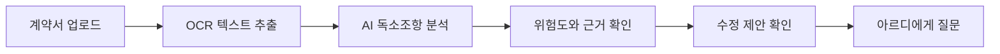

<div align="center">
  

  # RiskDetector

  **계약서 속 위험한 문장을 찾아주는 AI 계약서 분석 서비스**

  PDF, 이미지, 사진으로 된 계약서를 업로드하면 OCR과 AI 분석으로 독소조항,
  위험 근거, 수정 제안을 보기 쉽게 정리합니다.

  <br />

  <a href="https://riskdetectorpeuronteuendeu.onrender.com"><strong>서비스 바로가기</strong></a>
  &nbsp;|&nbsp;
  <a href="https://lilchaewon.github.io/RiskDetector/aboutRD/"><strong>소개 페이지 보기</strong></a>

  <br />
  <br />

  
  
  
  
</div>

---

## 서비스 소개

RiskDetector는 계약서를 혼자 읽기 어려운 사용자를 위해 만들어진 계약서 위험 탐지 서비스입니다.

사용자는 계약서 파일을 업로드하고, 서비스는 문서 내용을 읽어 위험할 수 있는 조항을 찾아줍니다. 분석 결과에서는 원문 위치, 위험도, 위험 이유, 수정 방향을 함께 확인할 수 있고, 아르디 챗봇에게 조항을 쉽게 풀어 설명해 달라고 물어볼 수 있습니다.

## 핵심 기능

| 기능 | 설명 |
| --- | --- |
| 계약서 업로드 | PDF, 이미지, 촬영본 형태의 계약서를 업로드합니다. |
| OCR 텍스트 추출 | 문서와 사진 속 계약 내용을 분석 가능한 텍스트로 변환합니다. |
| 독소조항 탐지 | 임대차, 근로, 용역 계약서의 위험 표현을 찾아냅니다. |
| 위험도 분류 | 주의, 검토, 위험 단계로 먼저 확인할 항목을 정리합니다. |
| 수정 제안 | 문제가 되는 이유와 더 나은 문장 방향을 함께 제공합니다. |
| 아르디 챗봇 | 선택한 조항을 쉬운 말로 설명하고 추가 질문을 도와줍니다. |

## 한눈에 보는 흐름



## 프로젝트 구조

```text
RiskDetector/
├─ aboutRD/                  # GitHub Pages 소개 페이지
├─ frontend/riskdetector-web # Next.js 프론트엔드
├─ backend_core/             # Spring Boot 백엔드
├─ backend_ai/               # AI, OCR Lambda 및 분석 로직
├─ ai_rag/                   # 법률 문서 RAG 데이터 파이프라인
├─ supabase/                 # Supabase 설정과 마이그레이션
└─ 계약서예시/               # 테스트용 계약서 예시
```

## 기술 스택

| 영역 | 사용 기술 |
| --- | --- |
| Frontend | Next.js, React, TypeScript, Tailwind CSS |
| Backend | Spring Boot, Java |
| Database / Auth | Supabase |
| AI / OCR | AWS Lambda, AWS Bedrock, OCR pipeline |
| RAG Data | 법령, 판례, 생활법률 데이터 |
| Deployment | Render, GitHub Pages |

## GitHub Pages

프로젝트 소개 페이지는 `aboutRD` 폴더에 정적 HTML, CSS, JavaScript로 구성되어 있습니다.

배포 주소:

```text
https://lilchaewon.github.io/RiskDetector/aboutRD/
```

## 참고

RiskDetector는 계약서 검토를 돕기 위한 서비스입니다. 분석 결과는 법률 판단을 보조하는 정보로 활용하고, 중요한 계약은 전문가 검토와 함께 확인하는 것을 권장합니다.
